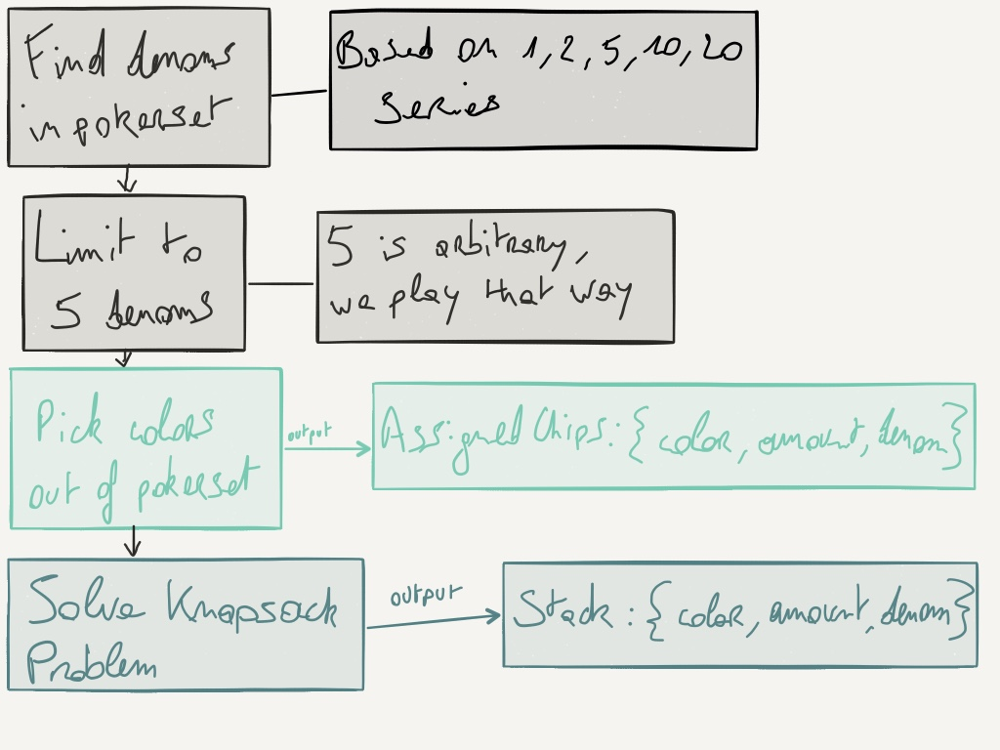
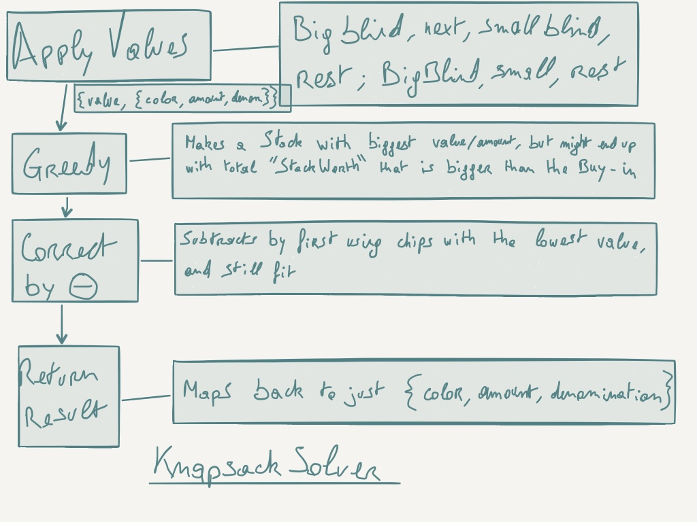

# Captains Log
## Day 14
Googled some more and came across some dynamic programming solution explanations to the 0/1 Knapsack problem. After following some more links in the rabbit hole, I came across [this javascript solution](https://rosettacode.org/wiki/Knapsack_problem/Bounded#JavaScript). This appears to be the best guide yet to the more specific problem I'm trying to solve, and it uses a Dynamic Programming solution. 

So now I have a path, I only have to write it as an implementation in my code somewhere now. :)

## Day 13
From this point on, I'll start logging the times when I work on this project, but for consistency's sake I'll also tag them with _Day x_. It'll usually be _SoftwareSandbox_ sessions, so a _Day_ will typically count as about 2-4 hours of work in an evening.

Today I realized that the stack I expected all the while, was wrong. It was wrong because the starting chips I had set up in my test have wrong amounts.

In my real life example, I use _orange_ chips with a denomination of .05, of which I have 75.

So instead of

    color:'orange',     amount: 75,     denomination:0.05
    color:'white-red',  amount: 100,    denomination:0.1
    color:'red-blue',   amount: 100,    denomination:0.25
    color:'blue-white', amount: 50,     denomination:0.5
    color:'green-pink', amount: 50,     denomination:1

I had

    color:'white-red',    amount: 100,    denomination:0.05
    color:'red-blue',     amount: 100,    denomination:0.1
    color:'blue-white',   amount: 50,     denomination:0.25
    color:'green-pink',   amount: 50,     denomination:0.5
    color:'black-salmon', amount: 25,     denomination:1

And all the while I was wondering why my 0.25 denomination wasn't getting a higher expected amount of chips in the stack... :sob:

Now, when I'm using the correct set up, I'm not getting ANY chips of denomination '1'. 

I thought about instead of a completely greedy solution, I might want to try a _chip-color proportion approximation_ solution, followed by a correction solution.

So for 5 denominations, and according to the stack I expect, that would mean proportions as follows:

    color:'orange'      denomination:0.05   proportion: 22.22
    color:'white-red'   denomination:0.1    proportion: 33.33
    color:'red-blue'    denomination:0.25   proportion: 26.66
    color:'blue-white'  denomination:0.5    proportion: 13.33
    color:'green-pink'  denomination:1      proportion: 4.44

Which **could** be _simplified_ to 

    proportion: 22
    proportion: 34
    proportion: 27
    proportion: 13
    proportion: 4

I still need to figure out what the proportions would look like with lower or higher amounts of denominations. Or even better, what the relation between those proportions is, and hence find an algorithm to give me these _sweetspot_ proportions based on an amount of denominations.

### Frank lend me his brain.

Maybe first use greedy solution, then try to approach ideal proportion solution? This won't work properly though, will be better to use a better algorithm from the start.

Fix for Buyin too small for amount of denoms: big blind denom should be "50 big blinds of buyin". This doesn't have anything to do directly with Knapsack solving, but it was interesting to see how Frank also struggles with the ping-pong between hitting those other variables (buyin vs. pokerset; buyin vs. stack; denominations vs. chip colors; ...) as well. It makes thinking about this whole ideal stack creation issue a lot more difficult. So we did get to thinking that limiting some of these variables will be easier to reason about.

_Ideal proportions_ are only possible with 5 denominations, a buyin of 10 and the known 1,2,5 series.

Let **amount** of denominations depend on buyin and small blind denom.

Spell out stacks with different amounts of denominations.

Constraining the denominations according to buyin should happen in Dealer.validation somewhere, with e.g. an underlimit of 50 times a buyin, and an upperlimit of 100 times a buyin.

Back to the Knapsacksolving, we then started discussing about how a possible other solution might be to attribute some sort of "importance" (proportion) to the denominations. And have the "importance" of a chipcolor weaken the more it's being used.

This in combination with constraints like stackworth can't exceed buyin, and chipcolorcount can't exceed total amount of chips in that color, might approximate our _Ideal proportions_ stack. (see [KnapsackSolverTest.js solve pokerbros case](https://github.com/Sch3lp/pokerchip-dealer/commit/fb743b09cfc1df8bdbc35a670d11eeabd05a96b2)).

Another idea of his was just to visualize/write down _Ideal proportions_ of other stacks that have a different amount of denominations to try and recognize patterns.

We got kicked out again the Cegeka building by security doing their job. Been a while since that happened for me, but it feels like we've been productive.

Vincent really has been productive. He was able to make a [Starcraft2 soundboard](https://github.com/verhoevenv/sc2soundboard) in Kotlin.

_My Life for Aiur!_

## Day 12
I made some diagrams that should explain the general flow of the program, and how the KnapsackSolver currently works.

## Day 11
I did no coding today.

## Day 10
Got reacquainted with floating point arithmetic. Discovered http://floating-point-gui.de/ excellently documents the issue and provides a cheat sheet for different languages.

Started looking for node libraries, and discovered that http://mikemcl.github.io/bignumber.js/ is the best one because this small library has no dependencies and is still being maintained. 

Current greedy + correction produces a _weird_ stack.

Expected:

    white-red      amount:10   denomination: 0.05 
    red-blue       amount:15   denomination: 0.1  
    blue-white     amount:12   denomination: 0.25 
    green-pink     amount:6    denomination: 0.5  
    black-salmon   amount:2    denomination: 1

But was:

    white-red      amount:16   denomination: 0.05 
    red-blue       amount:17   denomination: 0.1  
    blue-white     amount:8    denomination: 0.25 
    green-pink     amount:9    denomination: 0.5  
    black-salmon   amount:1    denomination: 1

## Day 9
Some derping around with `Array.from()` copying objects by reference where I expected them to be copied by value.

(Re-)Discovered `lodash`'s `_.deepCopy()`.

Something funky's going on that I'm already noticing in the `greedy` solve. I'm not sure all chip denominations are being used. I'm guessing that after I've properly implemented it, by doing some tweaking to value setting I can get a better distribution. Maybe by enforcing to have at least 1 of each denomination in the stack.

The way I'm trying to solve at the moment is by first applying a greedy solve, and afterwards correcting it by adding (highest value first) or subtracting chips (lowest value first).

## Day 8
My idea that weight == amount of chips divided by players is incorrect.

The reason is that it's not the weight of the entire stack that's constraining, but it's the weight of one chip stack (a stack of chips of 1 color). And this is indeed equal to the amount of chips divided by players.

The thing that's constraining the total stack is the buyin. So if anything, it's the denomination that equals weight.

## Day 7
Had to revisit the applyWeights function. It didn't make sense that the chip colors I had the most amounts of had the biggest weight. It should be the other way around.

## Day 6
Conversion of assigned chips to knapsack items is done.

Still unsure how to encapsulate _private_ methods `applyValues` and `applyWeights`, but still be able to separately test them.

Current solution is to separately export them, so at least you'd have to explicitly import them.

Also still unsure if I'll require the original chip object literals, which is why I haven't extracted those into a `AssignedChip` class yet.

## Day 5
Today I ventured into _Money Conversion Problems_ land.

After I tried to figure out what the ideal proportions of a stack would be based on the number of different colors, I started thinking that there had to be algorithms out there that already have proven solutions to this problem.

A couple of wikipedia links later, if anything, it confirms the hunch I had that these are not particularly easy problems to solve. Luckily there's a lot of documentation about it:

[Knapsack problem](https://en.wikipedia.org/wiki/Knapsack_problem)

[Change-making problem](https://en.wikipedia.org/wiki/Change-making_problem)

[Coin problem](https://en.wikipedia.org/wiki/Coin_problem)

Guess I'll have to do some reading first. :)

I also discovered [Money.js](http://openexchangerates.github.io/money.js/). Maybe this library can help me in some way as well. :pray:

---

Money.js can't help me.

I think I figured out that the problem I'm trying to solve is in fact the [Bounded Knapsack problem](https://en.wikipedia.org/wiki/Knapsack_problem#Definition).

The “knapsack” is the ideal Stack.

The items I want to put in are the chips. 

The item value is based on the "ideal proportion". For example an ideal proportion with 4 chip colors might look like 24/36/26/14.

The item weight (constraint) is based on the total amount of chips per color in the pokerset, each divided by the amount of players.

The extra constraint is that the total value of chips in the stack can't exceed the buy-in. I hope using the knapsack solution and then rearranging a little bit to adhere to the last constraint will be achievable (and comprehensible in code).

## Day 4
Big blind should have biggest _weight_ ~= proportion of stack

        10 * 0.05 = 0.5   0.22222
        15 * 0.10 = 1.5   0.33333
        12 * 0.25 = 3     0.26666
         6 * 0.5  = 3     0.13333
         2 * 1    = 2     0.04444

I feel like I've been productive in creating the `ColorPicker`. I also was a little bit proud of a silly [refactoring](https://github.com/Sch3lp/pokerchip-dealer/commit/90f6e3a8834ae1beeb29fab45f2d467fa3364767#diff-e7d239fcae0a96404762d00f1c47562c) I did, it's way shorter to read now, yet still comprehensible enough.

But where my code was "more logical" before (first add small blind, then big blind, then the rest), and also readable (by extension), now it's more concise but you have to figure out why I first switch around the position of small and big blind denominations and re-order on ascending denominations after the `combine` happened. I don't think it's that hard to understand. Especially since it's concise enough.

That's why I prefer the code the way it is now and why I felt proud afterwards.

## Day 3
Since there seem to be so many "rules" that can all have an impact, 
but that you might **not** want to apply in a hardcore fashion all the time.

It got me thinking of maybe representing all different aspects of a pokergame

_i.e. chips, their denominations, their value, their actual value, the buy-in, the amount of players, ..._

as rules (within a ruleset maybe).

So that you can enforce or "impose" (softer) these rules.

So maybe I start over, yes?

Like, keep the classes but assemble them out of rules.

## Day 2
Struggling with which problem to solve.

Because there are so many approaches.

For every problem scenario there's usually a couple of knowns and one to many unknowns.

Either you know your small and big blind denominations and want to play with these, no matter what buy-in.

Or, you know the buy-in and care about the speed of your game.

Speed is controlled by the amount of big blinds you get for your buy-in.
A high amount of big blinds will lead to a slower paced game and vice versa.

Or, you know the buy-in and what your ideal small and big blind denominations are, but you don't know which chips out of your pokerset are best to use.

I did some reading and learned that **in tournaments** you need to provide your players with a stack that is good for 50 big blinds in return for their buy-in.

## Day 1
Set out to code a program that helps me make nice Stacks for when we host poker nights.

I recently bought a new pokerset (a bigger one), which has way more different kinds of chips than the one I previously had. And it feels wasteful not to use them all in our game.